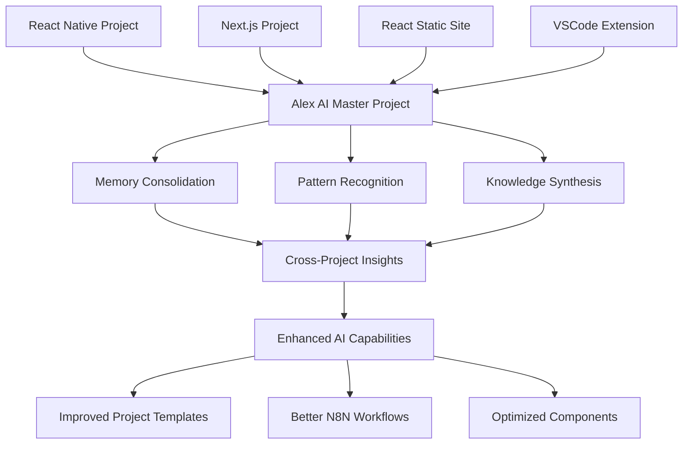
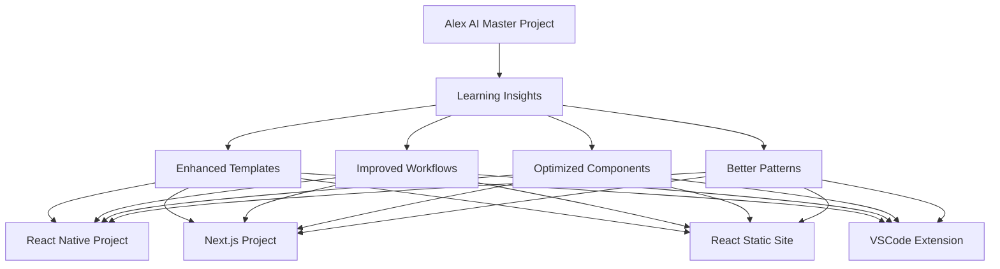

# 🧠 Alex AI Master Project Architecture
## Central Learning Hub for All Alex AI Projects

### 📅 Architecture Date: January 9, 2025

## 🎯 **Vision: Single Master Project with Bidirectional Learning**

**Alex AI Master Project** serves as the central learning hub that:
- **Learns from ALL projects** using Alex AI across different frameworks (React Native, React, Next.js, etc.)
- **Shares insights bidirectionally** across all projects in the monorepo
- **Evolves continuously** with knowledge from every project interaction
- **Maintains unified memory** and N8N sync across all applications

---

## 🏗️ **Master Project Architecture**

### **Central Learning Hub Structure**
```
alex-ai-master-project/
├── 🧠 memory-hub/                    # Central memory management
│   ├── cross-project-memories/       # Shared memories across all projects
│   ├── project-specific-memories/    # Individual project learnings
│   ├── pattern-recognition/          # AI pattern analysis
│   └── knowledge-synthesis/          # Cross-project insights
├── 🔄 n8n-sync-hub/                  # Central N8N coordination
│   ├── project-sync-workflows/       # Sync workflows for each project
│   ├── cross-project-triggers/       # Triggers that affect multiple projects
│   ├── learning-workflows/           # AI learning and adaptation
│   └── deployment-coordination/      # Coordinated deployments
├── 📊 analytics-hub/                 # Central analytics and insights
│   ├── project-performance/          # Performance across all projects
│   ├── learning-metrics/             # AI learning effectiveness
│   ├── user-behavior/                # Cross-project user patterns
│   └── optimization-recommendations/ # AI-driven optimizations
└── 🚀 deployment-hub/                # Central deployment management
    ├── project-templates/            # Reusable project templates
    ├── shared-components/            # Cross-project components
    ├── configuration-management/     # Unified configuration
    └── rollback-coordination/        # Coordinated rollbacks
```

---

## 🔄 **Bidirectional Learning System**

### **1. Project → Master Learning Flow**


### **2. Master → Project Enhancement Flow**


---

## 🧠 **Memory Management System**

### **Central Memory Hub Features**
- **Cross-Project Memory Sharing**: All projects contribute to and benefit from shared memory
- **Project-Specific Learning**: Each project maintains its own specialized knowledge
- **Pattern Recognition**: AI identifies patterns across different project types
- **Knowledge Synthesis**: Combines insights from all projects into unified intelligence

### **Memory Types**
1. **Technical Patterns**: Code patterns, architecture decisions, performance optimizations
2. **User Behavior**: How users interact with different project types
3. **Development Insights**: Best practices discovered across projects
4. **Integration Learnings**: How different frameworks work with Alex AI
5. **Performance Metrics**: Performance patterns across project types

---

## 🔄 **N8N Sync System**

### **Central N8N Coordination**
- **Project Sync Workflows**: Each project has dedicated sync workflows
- **Cross-Project Triggers**: Events in one project can trigger actions in others
- **Learning Workflows**: AI learning and adaptation workflows
- **Deployment Coordination**: Coordinated deployments across all projects

### **Sync Capabilities**
- **Real-time Memory Sync**: Instant memory sharing across projects
- **Configuration Sync**: Shared configurations and settings
- **Component Sync**: Shared components and templates
- **Learning Sync**: AI learning results shared across projects

---

## 📊 **Analytics and Insights**

### **Cross-Project Analytics**
- **Performance Comparison**: How different frameworks perform with Alex AI
- **User Behavior Patterns**: Cross-project user interaction patterns
- **Learning Effectiveness**: How well AI learns from different project types
- **Optimization Opportunities**: Areas for improvement across all projects

### **AI Learning Metrics**
- **Memory Utilization**: How effectively memories are used across projects
- **Pattern Recognition Accuracy**: How well AI identifies patterns
- **Cross-Project Correlation**: How insights from one project help others
- **Continuous Improvement**: Rate of AI capability enhancement

---

## 🚀 **Implementation Strategy**

### **Phase 1: Master Project Setup**
1. Create `alex-ai-master-project` as central hub
2. Implement central memory management system
3. Set up N8N sync workflows for all existing projects
4. Create analytics dashboard for cross-project insights

### **Phase 2: Bidirectional Integration**
1. Connect all existing projects to master project
2. Implement real-time memory sync
3. Set up cross-project learning workflows
4. Create shared component library

### **Phase 3: Advanced Learning**
1. Implement pattern recognition across projects
2. Create AI-driven optimization recommendations
3. Set up automated cross-project improvements
4. Implement predictive capabilities

### **Phase 4: Self-Evolution**
1. AI learns to create new project templates
2. Automated optimization of all projects
3. Predictive project recommendations
4. Self-improving AI capabilities

---

## 🎯 **Benefits of Master Project Architecture**

### **For Development**
- **Unified Learning**: All projects contribute to and benefit from shared AI learning
- **Consistent Experience**: Similar AI behavior across all project types
- **Rapid Development**: Reusable components and patterns from all projects
- **Continuous Improvement**: AI gets better with every project interaction

### **For AI Capabilities**
- **Cross-Project Intelligence**: AI understands patterns across different frameworks
- **Specialized Knowledge**: Each project type contributes specialized knowledge
- **Unified Memory**: Single source of truth for all AI knowledge
- **Evolving Intelligence**: AI capabilities grow with every project

### **For Business**
- **Faster Time-to-Market**: Reusable patterns and components
- **Better User Experience**: Consistent AI behavior across all projects
- **Reduced Development Costs**: Shared learning and components
- **Competitive Advantage**: Continuously improving AI capabilities

---

## 🔮 **Future Possibilities**

### **Advanced Capabilities**
1. **Predictive Development**: AI predicts what features will be needed
2. **Automated Optimization**: AI automatically optimizes all projects
3. **Cross-Project Innovation**: AI creates new features based on patterns
4. **Self-Evolving Architecture**: AI improves its own architecture

### **Scaling Opportunities**
1. **Multi-Client Support**: Different clients with different project types
2. **Industry Specialization**: Specialized AI for different industries
3. **Global Learning**: Learning from projects worldwide
4. **AI Ecosystem**: Complete AI development ecosystem

---

## 🎉 **Conclusion**

The **Alex AI Master Project** represents a revolutionary approach to AI development where:
- **Every project teaches the AI** something new
- **Every project benefits** from all other projects' learnings
- **The AI continuously evolves** with every interaction
- **Development becomes faster and better** with each new project

This creates a **self-improving development platform** that gets smarter with every project, regardless of the framework or technology stack used.

---

*Architecture designed by Alex AI Self-Referential System*  
*Date: January 9, 2025*  
*Status: Ready for Implementation*
