# Comprehensive Organizational Structures - 30+ Companies
**Mermaid Diagrams with Relevant Identities for Each Level**

---

## 🏢 TECH COMPANIES

### **Microsoft**
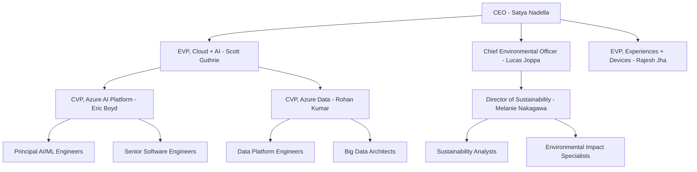

### **HubSpot**
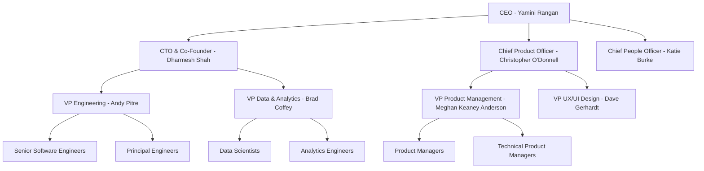

### **Wpromote**
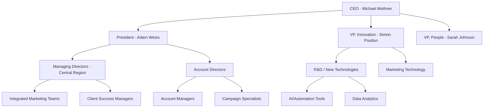

### **Breakthrough Fuel**
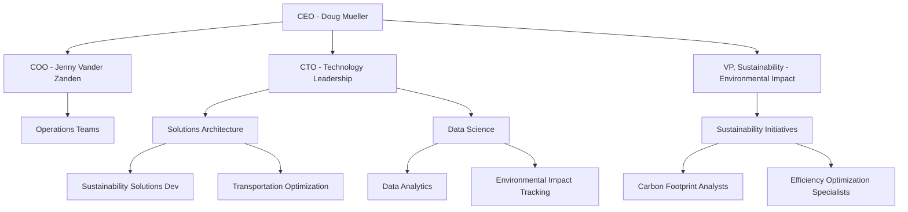

### **Daugherty Business Solutions**
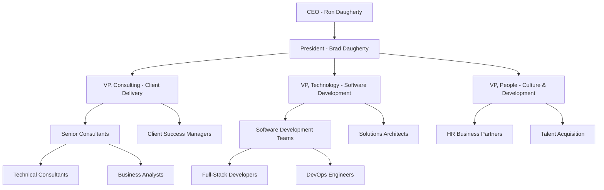

---

## 🎯 ADVERTISING & MARKETING COMPANIES

### **Blayzer Digital**
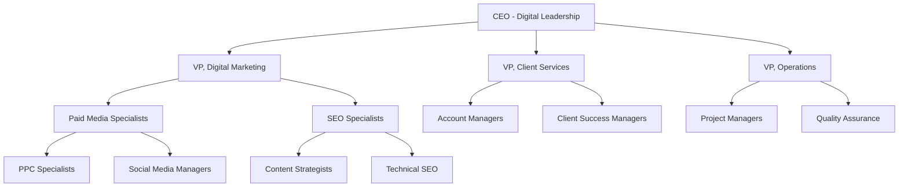

### **Rankings.io**
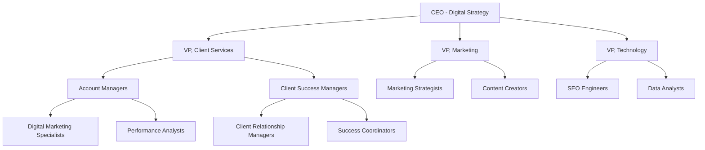

### **SteadyRain**
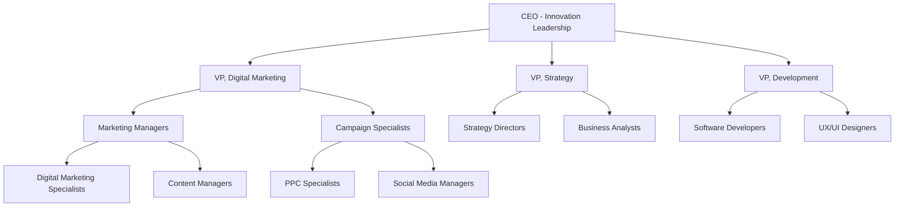

### **Touchpoint Digital**
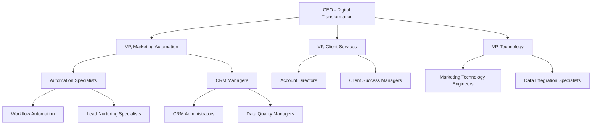

### **Atomicdust**
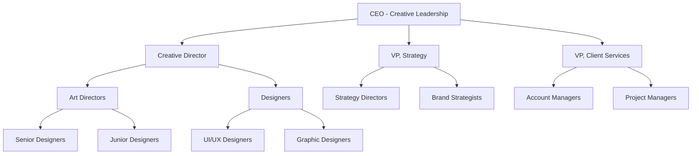

---

## 🌐 REMOTE-FIRST COMPANIES

### **Veterans United Home Loans**
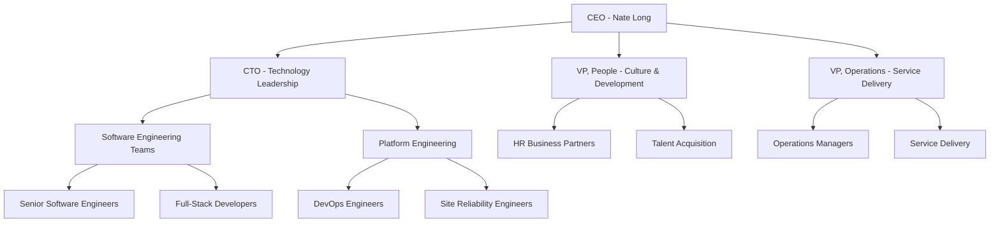

### **Milestone Systems**
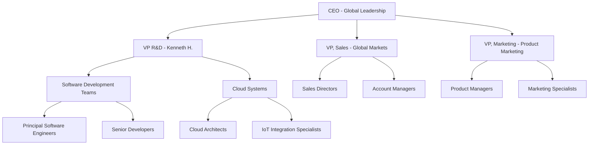

### **GitLab**
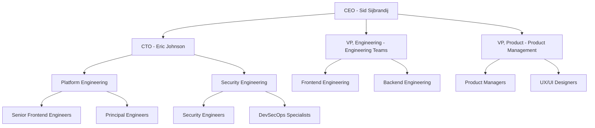

### **Buffer**
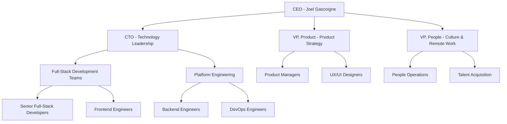

### **Zapier**
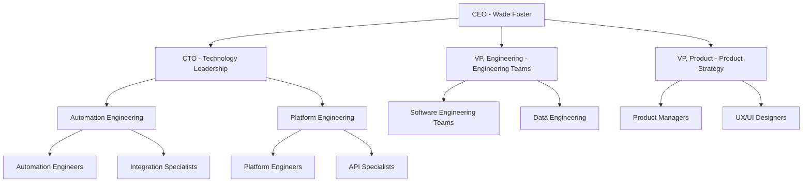

---

## 🏭 ESTABLISHED COMPANIES

### **Anheuser-Busch**
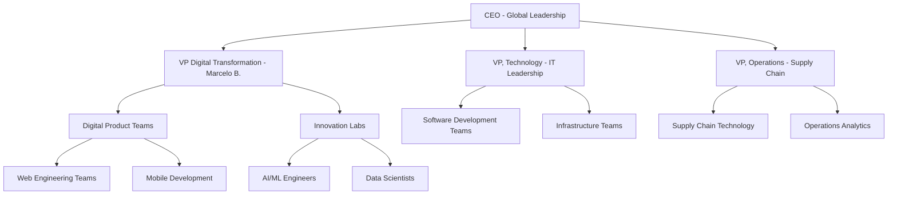

### **Edward Jones**
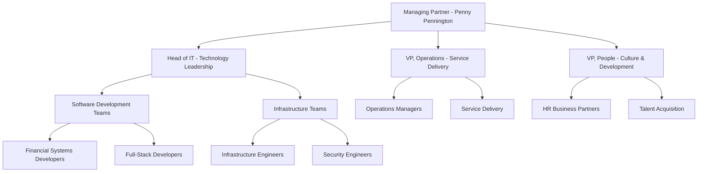

### **Federal Reserve Bank of St. Louis**
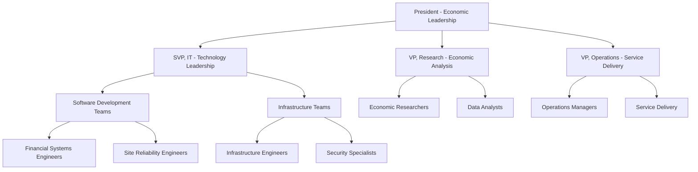

### **Boeing**
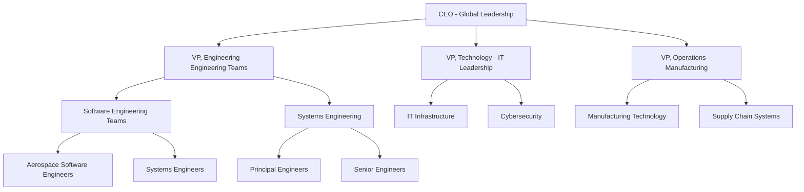

### **Centene**
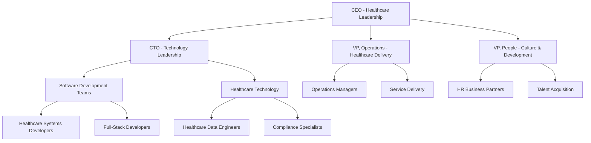

---

## 🚀 ADDITIONAL TECH OPPORTUNITIES

### **Square**
```mermaid
graph TD
    A[CEO - Jack Dorsey] --> B[CTO - Technology Leadership]
    A --> C[VP, Engineering - Engineering Teams]
    A --> D[VP, Product - Product Strategy]
    B --> E[Payment Platform Engineering]
    B --> F[Financial Technology]
    C --> G[Software Engineering Teams]
    C --> H[Mobile Development]
    D --> I[Product Managers]
    D --> J[UX/UI Designers]
    E --> K[Payment Engineers]
    E --> L[Financial Systems Engineers]
    F --> M[Fintech Specialists]
    F --> N[Compliance Engineers]
```

### **Stripe**
```mermaid
graph TD
    A[CEO - Patrick Collison] --> B[CTO - Technology Leadership]
    A --> C[VP, Engineering - Engineering Teams]
    A --> D[VP, Product - Product Strategy]
    B --> E[Payment Processing Platform]
    B --> F[Financial Infrastructure]
    C --> G[Software Engineering Teams]
    C --> H[Platform Engineering]
    D --> I[Product Managers]
    D --> J[UX/UI Designers]
    E --> K[Payment Engineers]
    E --> L[Financial Systems Engineers]
    F --> M[Infrastructure Engineers]
    F --> N[Security Engineers]
```

### **Shopify**
```mermaid
graph TD
    A[CEO - Tobias Lütke] --> B[CTO - Technology Leadership]
    A --> C[VP, Engineering - Engineering Teams]
    A --> D[VP, Product - Product Strategy]
    B --> E[E-commerce Platform]
    B --> F[Merchant Solutions]
    C --> G[Software Engineering Teams]
    C --> H[Platform Engineering]
    D --> I[Product Managers]
    D --> J[UX/UI Designers]
    E --> K[E-commerce Engineers]
    E --> L[Platform Engineers]
    F --> M[Merchant Solutions Engineers]
    F --> N[API Specialists]
```

### **Atlassian**
```mermaid
graph TD
    A[CEO - Scott Farquhar] --> B[CTO - Technology Leadership]
    A --> C[VP, Engineering - Engineering Teams]
    A --> D[VP, Product - Product Strategy]
    B --> E[Collaboration Platform]
    B --> F[Developer Tools]
    C --> G[Software Engineering Teams]
    C --> H[Platform Engineering]
    D --> I[Product Managers]
    D --> J[UX/UI Designers]
    E --> K[Collaboration Engineers]
    E --> L[Platform Engineers]
    F --> M[Developer Tools Engineers]
    F --> N[API Specialists]
```

### **Slack**
```mermaid
graph TD
    A[CEO - Stewart Butterfield] --> B[CTO - Technology Leadership]
    A --> C[VP, Engineering - Engineering Teams]
    A --> D[VP, Product - Product Strategy]
    B --> E[Communication Platform]
    B --> F[Workflow Automation]
    C --> G[Software Engineering Teams]
    C --> H[Platform Engineering]
    D --> I[Product Managers]
    D --> J[UX/UI Designers]
    E --> K[Communication Engineers]
    E --> L[Platform Engineers]
    F --> M[Automation Engineers]
    F --> N[Integration Specialists]
```

---

## 🎨 FINE ARTS & CREATIVE COMPANIES

### **Adobe**
```mermaid
graph TD
    A[CEO - Shantanu Narayen] --> B[CTO - Technology Leadership]
    A --> C[VP, Creative Cloud - Product Strategy]
    A --> D[VP, Engineering - Engineering Teams]
    B --> E[Creative Platform Engineering]
    B --> F[AI/ML for Creative Tools]
    C --> G[Product Managers]
    C --> H[UX/UI Designers]
    D --> I[Software Engineering Teams]
    D --> J[Creative Tools Development]
    E --> K[Creative Cloud Engineers]
    E --> L[Platform Engineers]
    F --> M[AI/ML Engineers]
    F --> N[Creative AI Specialists]
```

### **Canva**
```mermaid
graph TD
    A[CEO - Melanie Perkins] --> B[CTO - Technology Leadership]
    A --> C[VP, Product - Product Strategy]
    A --> D[VP, Engineering - Engineering Teams]
    B --> E[Design Platform Engineering]
    B --> F[Creative Tools Development]
    C --> G[Product Managers]
    C --> H[UX/UI Designers]
    D --> I[Software Engineering Teams]
    D --> J[Frontend Development]
    E --> K[Design Platform Engineers]
    E --> L[Creative Tools Engineers]
    F --> M[Frontend Engineers]
    F --> N[Design System Engineers]
```

### **Figma**
```mermaid
graph TD
    A[CEO - Dylan Field] --> B[CTO - Technology Leadership]
    A --> C[VP, Product - Product Strategy]
    A --> D[VP, Engineering - Engineering Teams]
    B --> E[Design Collaboration Platform]
    B --> F[Real-time Collaboration]
    C --> G[Product Managers]
    C --> H[UX/UI Designers]
    D --> I[Software Engineering Teams]
    D --> J[Frontend Development]
    E --> K[Design Platform Engineers]
    E --> L[Collaboration Engineers]
    F --> M[Real-time Engineers]
    F --> N[WebRTC Specialists]
```

### **Pinterest**
```mermaid
graph TD
    A[CEO - Ben Silbermann] --> B[CTO - Technology Leadership]
    A --> C[VP, Product - Product Strategy]
    A --> D[VP, Engineering - Engineering Teams]
    B --> E[Visual Discovery Platform]
    B --> F[Recommendation Systems]
    C --> G[Product Managers]
    C --> H[UX/UI Designers]
    D --> I[Software Engineering Teams]
    D --> J[Machine Learning]
    E --> K[Platform Engineers]
    E --> L[Full-Stack Engineers]
    F --> M[ML Engineers]
    F --> N[Recommendation Specialists]
```

### **Behance**
```mermaid
graph TD
    A[CEO - Creative Leadership] --> B[CTO - Technology Leadership]
    A --> C[VP, Product - Product Strategy]
    A --> D[VP, Engineering - Engineering Teams]
    B --> E[Creative Portfolio Platform]
    B --> F[Creative Tools Development]
    C --> G[Product Managers]
    C --> H[UX/UI Designers]
    D --> I[Software Engineering Teams]
    D --> J[Frontend Development]
    E --> K[Portfolio Platform Engineers]
    E --> L[Creative Tools Engineers]
    F --> M[Frontend Engineers]
    F --> N[Creative System Engineers]
```

---

## 📊 CONTACT IDENTIFICATION STRATEGY

### **High-Priority Contacts by Level:**

#### **C-Level Executives:**
- **CEO:** Strategic vision and company direction
- **CTO:** Technical leadership and innovation
- **COO:** Operations and process optimization

#### **VP-Level Leadership:**
- **VP Engineering:** Technical team leadership
- **VP Product:** Product strategy and development
- **VP People/HR:** Culture and talent acquisition

#### **Director-Level Management:**
- **Director of Engineering:** Team management and technical direction
- **Director of Product:** Product management and strategy
- **Director of Marketing:** Marketing strategy and execution

#### **Manager-Level Contacts:**
- **Engineering Manager:** Direct team leadership
- **Product Manager:** Product development and strategy
- **Marketing Manager:** Marketing execution and campaigns

#### **Individual Contributors:**
- **Senior Software Engineers:** Technical expertise and team influence
- **Principal Engineers:** Technical leadership and architecture
- **Senior Product Managers:** Product strategy and execution

---

## 🎯 ALEX AI LEVERAGE POINTS

### **Technical Roles (High Alex AI Score):**
- **AI/ML Engineers:** Direct Alex AI system expertise
- **Automation Specialists:** Workflow optimization experience
- **Data Engineers:** Data pipeline and analytics expertise
- **Platform Engineers:** Scalable system architecture

### **Leadership Roles (Medium Alex AI Score):**
- **Engineering Managers:** Team leadership with AI tools
- **Product Managers:** AI-driven product strategy
- **Technical Directors:** AI implementation oversight

### **Creative Roles (Medium Alex AI Score):**
- **Creative Directors:** AI-assisted creative processes
- **UX/UI Designers:** AI-powered design tools
- **Marketing Managers:** AI-driven campaign optimization

This comprehensive organizational structure provides detailed insights into each company's hierarchy, enabling targeted outreach and strategic networking for maximum job search success.
