# 🎨 Alex AI System Architecture Visualizations

**Generated**: 2025-01-07  
**Purpose**: Visual representation of system interconnections and crew relationships  
**Format**: Mermaid diagrams for comprehensive system understanding

---

## 🏗️ **System Architecture Overview**

---

## 👥 **Crew Member Relationships**

```mermaid
graph LR
    subgraph "Alex AI Crew"
        PICARD[🎖️ Captain Picard<br/>Strategic Leadership]
        DATA[🤖 Commander Data<br/>Technical Analysis]
        LAFORGE[⚙️ Lt. La Forge<br/>Infrastructure & DevOps]
        CRUSHER[🏥 Dr. Crusher<br/>Quality Assurance]
        TROI[💝 Counselor Troi<br/>User Experience]
        WORF[🛡️ Lieutenant Worf<br/>Security & Defense]
        UHURA[📡 Lieutenant Uhura<br/>Communication & Integration]
        QUARK[💰 Quark<br/>Business Operations]
        SEVEN[🔬 Seven of Nine<br/>Data Science & AI]
    end
    
    subgraph "System Components"
        APP[alex-ai-job-search]
        CORE[alex-ai-core]
        CREW_PKG[alex-ai-crew]
        MCP_PKG[alex-ai-mcp]
        MONITOR_PKG[alex-ai-monitoring]
        COMP_PKG[alex-ai-components]
    end
    
    PICARD --> APP
    PICARD --> CORE
    PICARD --> CREW_PKG
    
    DATA --> CORE
    DATA --> MONITOR_PKG
    DATA --> APP
    
    LAFORGE --> APP
    LAFORGE --> CORE
    LAFORGE --> MONITOR_PKG
    
    CRUSHER --> APP
    CRUSHER --> CORE
    CRUSHER --> MONITOR_PKG
    
    TROI --> APP
    TROI --> COMP_PKG
    TROI --> CORE
    
    WORF --> APP
    WORF --> CORE
    WORF --> MCP_PKG
    
    UHURA --> APP
    UHURA --> CORE
    UHURA --> MCP_PKG
    
    QUARK --> APP
    QUARK --> CORE
    QUARK --> MONITOR_PKG
    
    SEVEN --> CREW_PKG
    SEVEN --> MCP_PKG
    SEVEN --> CORE
```

---

## 🔄 **Data Flow Architecture**

---

## 🛡️ **Security Architecture**

---

## 📊 **Performance Monitoring Architecture**

---

## 🔗 **Integration Points Map**

---

## 🎯 **Crew Role Specialization Map**

---

## 📈 **System Health Dashboard**

```mermaid
graph TB
    subgraph "System Health Metrics"
        subgraph "Application Health"
            APP_HEALTH[Application Status<br/>✅ Healthy]
            API_HEALTH[API Status<br/>✅ Healthy]
            DB_HEALTH[Database Status<br/>✅ Healthy]
        end
        
        subgraph "Performance Metrics"
            RESPONSE_TIME[Response Time<br/>150ms avg]
            THROUGHPUT[Throughput<br/>1000 req/min]
            ERROR_RATE[Error Rate<br/>0.1%]
        end
        
        subgraph "Resource Usage"
            CPU_USAGE[CPU Usage<br/>45%]
            MEMORY_USAGE[Memory Usage<br/>2.1GB]
            DISK_USAGE[Disk Usage<br/>15GB]
        end
        
        subgraph "Security Status"
            SECURITY_SCORE[Security Score<br/>95/100]
            VULNERABILITIES[Vulnerabilities<br/>0 Critical]
            ACCESS_LOGS[Access Logs<br/>Normal]
        end
    end
    
    subgraph "Alerting System"
        ALERTS[Alert Status<br/>🟢 All Clear]
        NOTIFICATIONS[Notifications<br/>Email/Slack]
        ESCALATION[Escalation<br/>Auto-response]
    end
    
    APP_HEALTH --> ALERTS
    API_HEALTH --> ALERTS
    DB_HEALTH --> ALERTS
    
    RESPONSE_TIME --> NOTIFICATIONS
    THROUGHPUT --> NOTIFICATIONS
    ERROR_RATE --> NOTIFICATIONS
    
    CPU_USAGE --> ESCALATION
    MEMORY_USAGE --> ESCALATION
    DISK_USAGE --> ESCALATION
    
    SECURITY_SCORE --> ALERTS
    VULNERABILITIES --> ALERTS
    ACCESS_LOGS --> ALERTS
```

---

## 🚀 **Deployment Pipeline**

---

## 📋 **Summary**

These visualizations provide comprehensive insights into:

1. **System Architecture**: Overall structure and component relationships
2. **Crew Relationships**: How each crew member interacts with system components
3. **Data Flow**: How data moves through the system
4. **Security Architecture**: Multi-layered security approach
5. **Performance Monitoring**: Comprehensive performance tracking
6. **Integration Points**: Internal and external system integrations
7. **Crew Specializations**: Role-specific responsibilities and focus areas
8. **System Health**: Real-time health monitoring and alerting
9. **Deployment Pipeline**: Complete CI/CD workflow

Each diagram serves as a visual guide for understanding the system's complexity and the interconnected nature of all components and crew members.

---

*Generated by Alex AI Crew - Observation Lounge Session*  
*Date: 2025-01-07*
